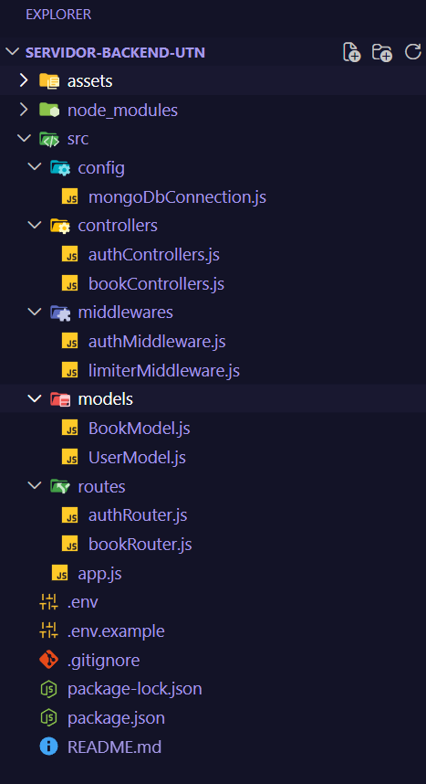
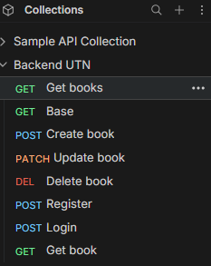
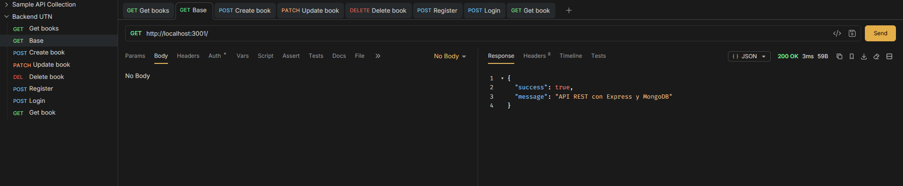
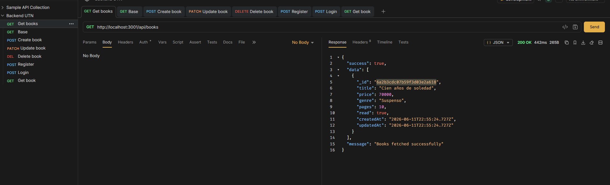
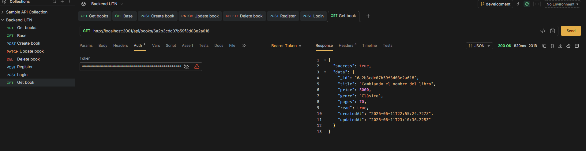
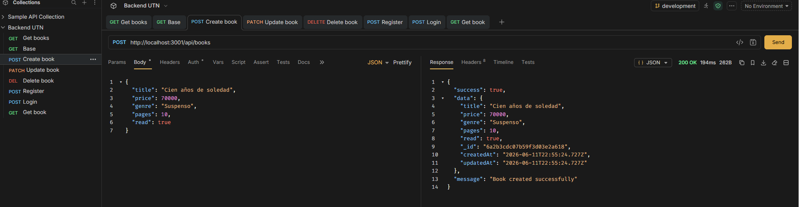
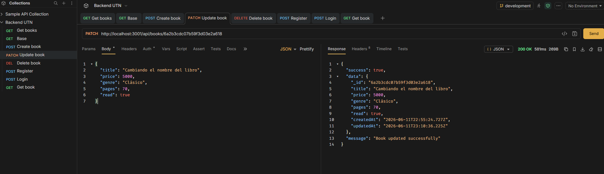
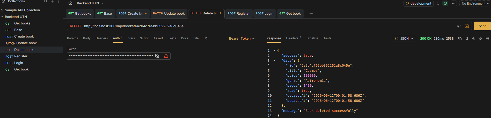
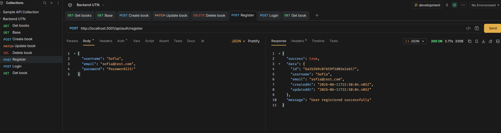
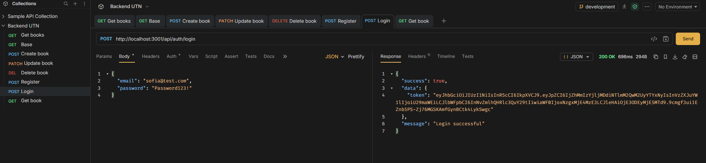

# 📚 API REST - Gestor de Libros

API REST desarrollada con Express y MongoDB que implementa autenticación con JWT y arquitectura MVC. Permite a usuarios registrados gestionar su lista de libros personal.

---

## 🛠️ Tecnologías

- Node.js
- Express
- MongoDB + Mongoose
- JWT (jsonwebtoken)
- bcryptjs
- dotenv
- cors
- express-rate-limit

---

## 📁 Estructura MVC



```
servidor-backend-utn/
├── assets/
│   └── ...
├── src/
│   ├── config/
│   │   └── mongoDbConnection.js
│   ├── controllers/
│   │   ├── authControllers.js
│   │   └── bookControllers.js
│   ├── middlewares/
│   │   ├── authMiddleware.js
│   │   └── limiterMiddleware.js
│   ├── models/
│   │   ├── BookModel.js
│   │   └── UserModel.js
│   └── routes/
│       ├── authRouter.js
│       └── bookRouter.js
├── app.js
├── .env.example
├── .gitignore
└── package.json

```

---

## ⚙️ Instalación y ejecución

### 1. Clonar el repositorio

```bash
git clone https://github.com/SofiaDeAlessandre/tp-servidor-backend-utn.git
cd servidor-backend-utn
```

### 2. Instalar dependencias

```bash
npm install
```

### 3. Configurar variables de entorno

Crear un archivo `.env` en la raíz del proyecto basándose en `.env.example`:

```
MONGODB_URI=mongodb+srv://<usuario>:<password>@<cluster>.mongodb.net/<nombre_db>?appName=<appName>
PORT=3001
JWT_SECRET=tu_clave_secreta
```

### Configurar MongoDB Atlas

1. Crear una cuenta en [cloud.mongodb.com](https://cloud.mongodb.com)
2. Crear un cluster gratuito (M0)
3. Ir a **Security → Network Access** → agregar `0.0.0.0/0`
4. Ir al cluster → **Connect** → **Drivers**
5. Destildar la opción **SRV Connection String**
6. Copiar la connection string y reemplazar `<password>` con tu contraseña
7. Agregar el nombre de la base de datos antes del `?`: mongodb://<usuario>:<password>@host1,host2,host3/<nombre_db>?ssl=true&replicaSet=...
8. Pegar la string completa en el `.env` como valor de `MONGODB_URI`

### 4. Iniciar el servidor

```bash
npm run dev
```

El servidor estará disponible en `http://localhost:3001`

---

## 🔐 Autenticación

Las rutas de libros requieren un token JWT válido. Para obtenerlo:

1. Registrarse en `POST /api/auth/register`
2. Iniciar sesión en `POST /api/auth/login`
3. Usar el token en el header de cada request protegida:

```
Authorization: Bearer <token>
```

### Requisitos de contraseña

La contraseña debe tener al menos:
- 8 caracteres
- 1 letra mayúscula
- 1 número
- 1 carácter especial (@$!%*?&.#_-)

---

## 📡 Endpoints

### Autenticación (públicos)

| Método | Ruta | Descripción |
|--------|------|-------------|
| POST | `/api/auth/register` | Registra un nuevo usuario |
| POST | `/api/auth/login` | Inicia sesión y devuelve token |

### Libros (privados — requieren token)

| Método | Ruta | Descripción |
|--------|------|-------------|
| GET | `/api/books` | Lista todos los libros del usuario |
| GET | `/api/books/:id` | Obtiene un libro por ID |
| POST | `/api/books` | Crea un nuevo libro |
| PATCH | `/api/books/:id` | Actualiza un libro |
| DELETE | `/api/books/:id` | Elimina un libro |

---

## 📝 Ejemplos de requests

### Registro

```json
POST /api/auth/register

{
  "username": "sofia",
  "email": "sofia@gmail.com",
  "password": "Sofia123!"
}
```

### Login

```json
POST /api/auth/login

{
  "email": "sofia@gmail.com",
  "password": "Sofia123!"
}
```

### Crear libro

```json
POST /api/books
Authorization: Bearer <token>

{
  "title": "Cien años de soledad",
  "price": 14000,
  "genre": "Realismo mágico",
  "pages": 471,
  "read": true
}
```

### Actualizar libro

```json
PATCH /api/books/:id
Authorization: Bearer <token>

{
  "price": 15000,
  "read": true
}
```

### Eliminar libro

```
DELETE /api/books/:id
Authorization: Bearer <token>
```

---

## 📸 Colección Bruno











La colección de pruebas se encuentra en el archivo `Backend UTN/` en la raíz del proyecto.

---

## 🚀 Deploy

No se realizó deploy. El proyecto puede ejecutarse localmente siguiendo las instrucciones de instalación.

---

Sofía De Alessandre — Jun 2026

